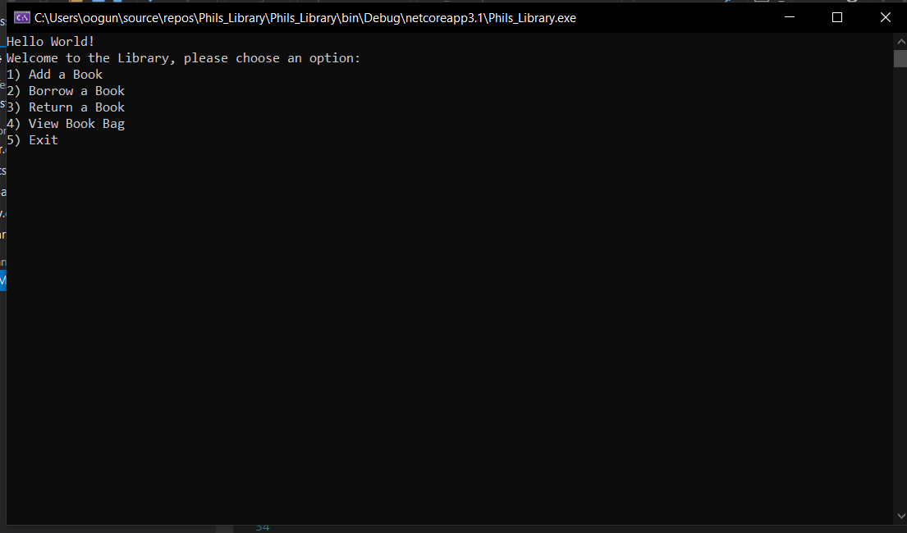

#LIBRARY CONSOLE APPLICATION - WITH UNIT TESTING

Author: Lami Beach
____________________________________________________________________________________________________________________________________________________________________________________________________________________________________________________________________________________________________________________________________________________________________________________________________________________________________________________________________________________________________________________________________________________________________________________________________________________________________________________________________________________________________________________

Description :

 A Library Console Application:

This is a C# console application that allows users to borrow and return books from a library. 
The Borrowing library is a generic collection and Book is a separate class that holds all the properties and behaviors.
User interface, users are able to add and remove items from the newly created library and place 
them into another generic collection, to prove the movement of the individual objects.

____________________________________________________________________________________________________________________________________________________________________________________________________________________________________________________________________________________________________________________________________________________________________________________________________________________________________________________________________________________________________________________________________________________________________________________________________________________________________________________________________________________________________________________

Getting Started
Clone this repository to your local machine.

$ git clone [https://github.com/Omac092627/Library_Application]
To run the program from Visual Studio:
Select File -> Open -> Project/Solution

Next navigate to the location you cloned the Repository.

Double click on the Library_Application directory.

Then select and open Library_Application

____________________________________________________________________________________________________________________________________________________________________________________________________________________________________________________________________________________________________________________________________________________________________________________________________________________________________________________________________________________________________________________________________________________________________________________________________________________________________________________________________________________________________________________

Visuals

Start the app

____________________________________________________________________________________________________________________________________________________________________________________________________________________________________________________________________________________________________________________________________________________________________________________________________________________________________________________________________________________________________________________________________________________________________________________________________________________________________________________________________________________________________________________